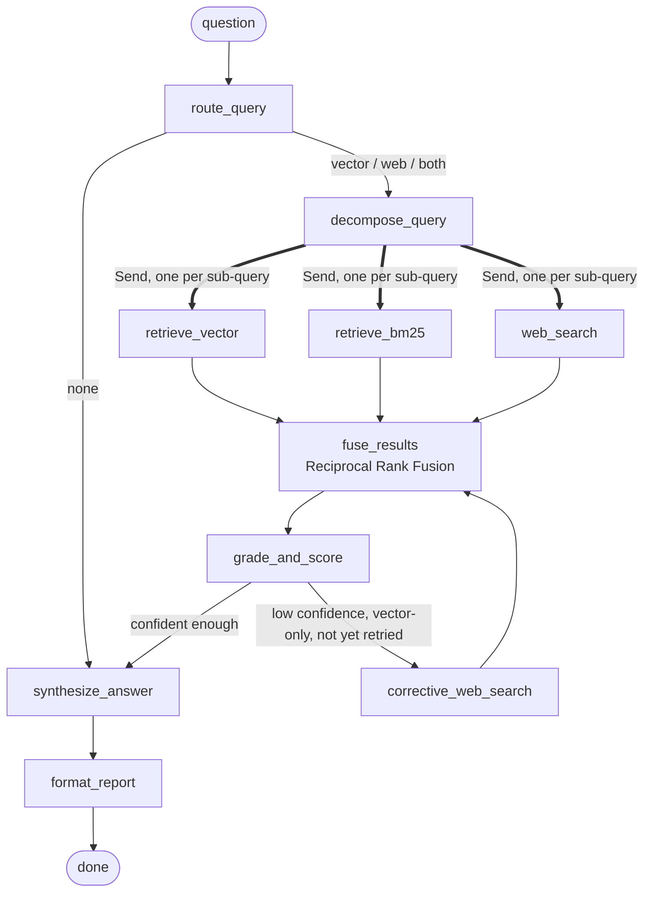

# Adaptive RAG Research Assistant

Ask a research question. The system autonomously decides whether to retrieve from a local
document store, search the web, or both, decomposes compound questions into sub-queries,
retrieves with both dense (vector) and sparse (BM25) search, fuses results across every
retrieval path, checks its own confidence, and falls back to web search when the local
knowledge base comes up short — then synthesizes a cited, transparency-reported answer,
streamed live to the browser as each step of the pipeline runs.

Built with LangGraph, Chroma, and Tavily. Chat/reasoning defaults to Anthropic's Claude when an
`ANTHROPIC_API_KEY` is set, with automatic fallback to Google Gemini (free tier) on error;
Gemini always handles embeddings. No paid services are required — leave `ANTHROPIC_API_KEY`
blank to run entirely on Gemini's free tier.

<!--
  TODO(portfolio polish): drop a screenshot or short GIF of the web UI here, e.g.
  
  A ~3-5 min demo video link (YouTube/Loom) can go right below it.
-->

## Concepts demonstrated

- **Agentic / Self-RAG routing** — an LLM router decides per-query whether to hit the local
  knowledge base, the web, both, or neither, before any retrieval happens.
- **Query decomposition** — compound questions are broken into focused, self-contained
  sub-queries that are retrieved independently and fused back together.
- **Hybrid retrieval (dense + sparse)** — every sub-query is retrieved via both a Chroma vector
  store (semantic similarity) and BM25 keyword search over the same corpus, so exact
  names/acronyms that embeddings under-rank still surface.
- **RAG Fusion (Reciprocal Rank Fusion)** — results from every sub-query and every retrieval path
  (vector, BM25, web) are merged and reranked by RRF score, not concatenated or naively
  deduplicated.
- **Confidence scoring / Corrective-RAG** — retrieved documents are graded for relevance; when
  confidence on a vector-only route falls below threshold, the system automatically falls back to
  a web search before answering.
- **Citation-mapped synthesis** — citation markers are assigned deterministically from fused rank
  order in code, not left to the LLM to invent.
- **LangGraph orchestration** — the whole pipeline is a `StateGraph` with conditional edges and
  `Send`-based fan-out for parallel sub-query retrieval, not a linear chain.
- **Streaming + explainability** — the API streams per-node progress over SSE, and every answer
  ships with a structured "Research Summary": route, sub-queries, per-source retrieval counts,
  fused document count, confidence, whether a corrective search fired, and a per-node latency
  breakdown — the same facts the graph already computes, surfaced instead of hidden.
- **RAGAS evaluation harness** — a golden-question dataset scored with non-LLM context
  precision/recall (string/set overlap against reference contexts, not semantic judgment)
  and, optionally, LLM-judged faithfulness/answer relevancy, run explicitly via
  `rag-assistant eval` rather than left unmeasured. The dataset spans every route (`vector`,
  `web`, `both`, `none`), including a case designed to exercise the corrective-fallback loop.
  It's a small (13-question), hand-curated set with no adversarial cases and no naive-RAG
  baseline to compare against — useful as a regression smoke test, not as proof the adaptive
  pipeline outperforms a simpler one.
- **Provider fallback** — Anthropic Claude is the primary chat/reasoning model when
  `ANTHROPIC_API_KEY` is set, with `.with_fallbacks()` to Gemini on error; embeddings always go
  through Gemini. Falls back to Gemini-only if no Anthropic key is configured.
- **Incremental indexing** — `rag-assistant ingest` hashes file contents against a manifest and
  only re-embeds changed or new files, removing chunks for deleted files, instead of rebuilding
  the whole collection every run (`--full` forces a clean rebuild).
- **Live graph execution visualization** — the web UI renders the LangGraph pipeline as a stepper
  that highlights each node as it runs, sourced from the same per-node SSE progress events the
  streaming endpoint already emits.

## Architecture



- `retrieve_vector` / `retrieve_bm25` / `web_search` fan out via `Send` — one invocation per
  sub-query, per applicable route — and join back at `fuse_results`.
- `corrective_web_search` loops back into `fuse_results` at most once per question (guarded by
  `correction_attempted` in state, backstopped by a `recursion_limit`).
- Every node is wrapped at registration time to record its own wall-clock latency into
  `node_timings` (an `operator.add`-reduced state field), which is what powers the latency
  breakdown in the Research Summary panel below — instrumentation with no changes to any node's
  own logic.

## Explainability: the Research Summary panel

Every answer — from both `POST /research` and the streaming `POST /research/stream` — carries a
structured summary alongside the prose report:

```json
{
  "route": "vector",
  "sub_queries": ["...", "..."],
  "retrieval_counts": { "vector": 16, "bm25": 16, "web": 0 },
  "fused_document_count": 6,
  "confidence_score": 0.62,
  "correction_attempted": false,
  "node_latencies_ms": [{ "node": "route_query", "latency_ms": 1523.7 }, "..."],
  "total_latency_ms": 21026.6
}
```

The web UI renders this as a panel: route, a sub-query checklist, per-source retrieval counts,
the post-fusion unique document count, confidence, whether the corrective fallback fired, and a
latency table grouped by pipeline stage. It exists so the assistant doesn't just produce an
answer — it shows its work, which matters both for debugging and for demoing an agentic system as
something more than "a single LLM call with extra steps."

## Setup

```bash
uv sync
cp .env.example .env
# fill in GOOGLE_API_KEY (https://aistudio.google.com/apikey) and
# TAVILY_API_KEY (https://app.tavily.com) in .env
# optionally also fill in ANTHROPIC_API_KEY (https://console.anthropic.com/settings/keys) to
# use Claude as the primary chat model, with Gemini as automatic fallback

uv run rag-assistant hello    # confirms chat model connectivity (Anthropic if set, else Gemini)
uv run rag-assistant ingest   # embeds the sample corpus (data/corpus/) into Chroma, incrementally
```

Or run the API + Redis via Docker Compose instead:

```bash
docker compose up --build   # api on http://localhost:8000, redis alongside it
```

> **Free-tier quota note:** if `ANTHROPIC_API_KEY` is unset, chat calls fall back to Gemini,
> whose free tier caps at ~20 requests/day; one research question costs ~4 calls (route,
> decompose, grade, synthesize) plus embedding calls (embeddings always go through Gemini
> regardless of the chat provider). Budget accordingly when running `ask`, `serve`, or `eval`
> repeatedly in a single day.

## Usage

### CLI

```bash
uv run rag-assistant ask "Who founded Anthropic and what is their safety research called?"
uv run rag-assistant ask "What is the most recent Claude model release?"
uv run rag-assistant ask "Compare Anthropic and Mistral AI's founding stories and safety focus."
```

`ingest` is incremental by default: it hashes each file in `data/corpus/` against a manifest and
only re-embeds new or changed files, removing chunks for any file that's been deleted since the
last run. Pass `--full` to reset the collection and re-embed everything from scratch:

```bash
uv run rag-assistant ingest --full
```

Debug commands for individual pieces of the pipeline:

```bash
uv run rag-assistant retrieve "anthropic founders" --k 4   # raw vector-store retrieval
uv run rag-assistant search "claude model releases 2026"   # raw Tavily web search
```

### API

```bash
uv run rag-assistant serve   # starts FastAPI on http://127.0.0.1:8000
```

```bash
curl -X POST http://127.0.0.1:8000/research \
  -H "Content-Type: application/json" \
  -d '{"question": "Who founded Anthropic and what is their safety research called?"}'
```

```bash
curl -N -X POST http://127.0.0.1:8000/research/stream \
  -H "Content-Type: application/json" \
  -d '{"question": "Who founded Anthropic and what is their safety research called?"}'
```

`/research/stream` emits Server-Sent Events — one `"progress"` frame per graph node as it
completes, then a final `"done"` frame carrying the report and the Research Summary above (or a
`"error"` frame on failure, since the HTTP status is already 200 by the time streaming starts).

Interactive API docs at `http://127.0.0.1:8000/docs`.

### Web UI

A React + Vite single-page app in `frontend/` streams `/research/stream` live. A graph
visualization stepper highlights each LangGraph node as it runs (grouping the fanned-out
`retrieve_vector` / `retrieve_bm25` / `web_search` nodes into one "Retrieve" stage with
per-source counts, and marking `corrective_web_search` as skipped when the confidence gate
doesn't trigger it), then renders the markdown report and the Research Summary panel.

```bash
uv run rag-assistant serve       # terminal 1 -- backend on http://127.0.0.1:8000

cd frontend
npm install
npm run dev                      # terminal 2 -- UI on http://localhost:5173
```

The backend allows CORS from `http://localhost:5173` by default. If the backend runs elsewhere,
copy `frontend/.env.example` to `frontend/.env` and set `VITE_API_BASE_URL`.

### Evaluation

```bash
uv run rag-assistant eval --limit 3               # non-LLM metrics only (no extra Gemini calls)
uv run rag-assistant eval --limit 3 --llm-judge    # adds Faithfulness + ResponseRelevancy scoring
uv run rag-assistant eval --limit 3 --output results.json
```

Runs the graph against a small hand-authored golden dataset (`data/golden_eval/dataset.jsonl`),
checks route/source expectations for free, and scores retrieval quality with RAGAS
(`NonLLMContextPrecisionWithReference`, `NonLLMContextRecall` by default). Prints an estimated
Gemini call count before running, since `limit` — not `--llm-judge` — is the dominant lever
against the daily quota (graph execution alone is ~4 calls/question).

## Example questions per concept

| Concept | Example question |
| --- | --- |
| Vector routing | "Who founded Anthropic and what is their safety research called?" |
| Web routing | "What is the most recent Claude model release?" |
| No retrieval (general knowledge) | "What is the capital of France?" |
| Query decomposition | "Compare Anthropic and Mistral AI's founding stories and safety focus." |
| Corrective fallback | "What safety research did Anthropic publish this week?" (recent/narrow enough that the local corpus alone often scores low, triggering a web search fallback) |

## Design decisions

**Why hybrid (vector + BM25) retrieval, not vector-only?** Dense embeddings are strong on
semantic/paraphrased queries but can under-rank exact keyword matches — model names, acronyms,
proper nouns — that a small corpus makes easy to miss entirely if the wording doesn't line up.
BM25 costs nothing extra to add (`rank_bm25`, no external service, rebuilt in-memory from the
same chunks that get embedded) and only ever adds candidates into fusion; it never replaces the
vector path.

**Why Reciprocal Rank Fusion over an LLM-based reranker?** RRF is a pure, deterministic function
of rank position across ranked lists — no additional model call, no added latency, no added
quota cost — and is a well-established way to combine heterogeneous retrieval paths (vector,
BM25, web) without having to calibrate their scores onto a common scale.

**Why Corrective-RAG (confidence-gated web fallback) instead of always searching the web?**
Always searching the web on every question would spend Tavily quota and latency even when the
local corpus already answers confidently. Gating the fallback on a relevance-graded confidence
score means the web search only fires when the vector-only route is actually falling short —
demonstrating self-assessment rather than blind escalation.

**Why SSE streaming instead of a single blocking response?** The graph can take 10-20+ seconds
end-to-end (multiple sequential LLM calls plus fanned-out retrieval). A blocking response gives
no feedback during that window; `stream_mode="updates"` gives per-node progress essentially for
free, since LangGraph already emits these events — the only added work is reshaping them into SSE
frames.

**Why RAGAS for evaluation instead of eyeballing answers?** Manually judging "is this answer
good" doesn't scale and isn't repeatable across changes to prompts or retrieval. RAGAS's
non-LLM metrics (`NonLLMContextPrecisionWithReference`, `NonLLMContextRecall`) score retrieval
quality against a golden dataset with zero additional LLM calls, so regressions in retrieval can
be caught without spending quota — LLM-judged metrics (faithfulness, relevancy) are opt-in for
when that extra cost is worth it.

## Production readiness

Beyond the core RAG pipeline, the API is hardened for running as an actual service rather than a
local demo script:

| Area | What's there |
| --- | --- |
| Containerization | Multi-stage `Dockerfile` (non-root user), `docker-compose.yml` wiring `api` + `redis` with a named volume for the Chroma persist directory (`chromadb.HttpClient` server mode is a documented TODO if this ever needs multiple `api` replicas — embedded Chroma's SQLite backing locks the file to one process) |
| Health & readiness | `GET /health` is a pure liveness check; `GET /ready` actually pings Chroma (`_collection.count()`) and Tavily (`HEAD` request) and returns 503 if either dependency is down, so an orchestrator can distinguish "process is up" from "can actually serve a request" |
| Input validation | `question` is required, capped at 2000 chars, HTML-tag-stripped, and rejected as gibberish if under 10% alphanumeric — all in a pydantic `field_validator`, so bad input 422s before it ever reaches the graph |
| Rate limiting | `slowapi`-based, both per-IP (`RATE_LIMIT_RPM`, default 10/min) and a global cap (`RATE_LIMIT_RPM_GLOBAL`, default 30/min) across `/research` and `/research/stream` |
| Timeouts | Tavily's HTTP client is capped at `TAVILY_TIMEOUT_SECONDS` (default 10s); the whole graph execution behind `/research/stream` is bounded by `GRAPH_TIMEOUT_SECONDS` (default 45s) via a monotonic-clock deadline around `astream()`, emitting an `"error"` SSE frame and closing the connection instead of hanging indefinitely |
| Graceful shutdown | SIGTERM is caught via `loop.add_signal_handler` inside the FastAPI lifespan; active SSE connections (tracked in a `weakref.WeakSet`) are sent a `"close"` frame before the process exits, instead of being cut off mid-stream |
| Structured logging | JSON logs (`python-json-logger`) with a UUID4 `trace_id` generated per request by an ASGI middleware, propagated through `contextvars` *and* threaded explicitly into the LangGraph state (belt-and-suspenders, since LangGraph's internal scheduling isn't guaranteed to preserve context automatically) — every log line, including each node's completion log, carries `trace_id`/`node`/`route`/`latency_ms`, and the response carries the same trace ID in an `X-Trace-Id` header |
| Caching | Redis-backed, best-effort (`USE_CACHE=false` or any Redis error both degrade silently to "no cache" — a cache outage is never worse than having no cache): router decisions keyed by question (`CACHE_TTL_ROUTER`, 5min), Tavily results keyed by query (`CACHE_TTL_TAVILY`, 10min), synthesized answers keyed by question + route + fused source IDs (`CACHE_TTL_SYNTHESIS`, 30min) — all under a `v1:` key prefix so a payload-shape change can be rolled out by bumping the prefix rather than migrating existing entries |
| Configuration | All of the above is `pydantic-settings`-driven (`config.py`), reading exclusively from environment variables with fail-fast validation at startup instead of scattered `os.environ.get()` calls with silent defaults |

## Self-audit: findings & fixes

A structured pass through routing, retrieval, corrective RAG, citations, evaluation, and
streaming — the kind of review that unit tests alone don't catch — surfaced real gaps beyond
happy-path correctness. Fixed:

| Area | Finding | Fix |
| --- | --- | --- |
| Vector store | Chroma had no explicit distance metric, silently defaulting to L2 while Gemini embeddings are meant to be compared via cosine similarity | Set `hnsw:space: cosine` explicitly and rebuilt the index (`ingest --full`) |
| Web search resilience | A Tavily outage/rate-limit raised unhandled and crashed the graph node | `WebSearchTool.search` now catches the failure and degrades to `[]` |
| Answer synthesis | An empty `fused_documents` was treated as one case ("no retrieval needed"), but it also happens when retrieval is attempted and comes back empty — same prompt, very different risk of confident hallucination | Split into `NO_CONTEXT_PROMPT` (route == `none`) vs. `EMPTY_RETRIEVAL_PROMPT` (retrieval ran, found nothing), which forces the model to state upfront that no sources were found |
| Non-streaming API | `/research` only caught `RuntimeError`; any other exception fell through to a bare, contentless 500 | Broadened to `except Exception`, still raised as a proper `HTTPException` with `detail` |
| Documentation | README implied RAGAS's semantic, LLM-judged `context_precision`/`context_recall`, when the harness actually runs the non-LLM overlap variants | Relabeled accurately, and noted the eval set is small and non-adversarial with no baseline comparison |

Verified with the full offline suite (68/68) plus a live end-to-end run: a real router call
picked the `web` route for a live-price question, a simulated Tavily outage was forced, and the
resulting Research Summary (`retrieval_counts: 0`, `confidence_score: 0.0`, `citations: []`) and
synthesized answer ("No relevant sources were found...") both came out correct — confirming the
state plumbing, not just the code path in isolation.

Gaps identified but deliberately not yet acted on: no few-shot examples in the router/
decomposition prompts, exact-content-hash dedup can still let the same source get cited twice
under different markers if local and web copies differ even slightly, and synthesis has no
token/context-length cap on however many documents fusion returns.

## Future improvements

Deliberately scoped out of v1 as lower-leverage for a single-user portfolio project, or as
needing a concrete driving requirement before they're worth the added complexity:

- **Metadata filtering** — filter retrieval by source/date/tag before fusion, not just rerank
  after the fact. Useful once the corpus grows beyond a handful of hand-picked files.
- **Qdrant (or another dedicated vector DB) instead of Chroma** — worth it once metadata
  filtering, multi-tenancy, or corpus size actually demand it; Chroma is not the bottleneck today.
- **Authentication** — no user accounts or API keys today; every request is anonymous. Needed
  before this could be exposed as a multi-user service.
- **Multi-tenancy** — one shared corpus/index for everyone; would need per-tenant indexes or
  namespacing to isolate data between users.

## Testing

```bash
uv run pytest          # offline unit + node + e2e tests (no external API calls)
uv run pytest -m live  # also exercises real Gemini/Tavily calls; requires .env and a run of `ingest` first
uv run ruff check .
```

```bash
cd frontend
npm test               # Vitest + React Testing Library — hooks and components
```

## Project layout

```
src/rag_assistant/
├── config.py, llm.py, logging_conf.py   # settings, model factories, structured JSON logging
├── tracing.py, cache.py, readiness.py    # trace-ID contextvar, Redis cache, Chroma/Tavily health checks
├── ingestion/                            # load -> split -> embed -> index the sample corpus
├── retrieval/                            # Chroma vector store, BM25 keyword store, Tavily web search
├── fusion/rrf.py                         # Reciprocal Rank Fusion (pure function)
├── grading/relevance_grader.py           # batched LLM relevance grading
├── graph/                                # ResearchState, one node module per concept, build_graph(),
│                                          # research_summary.py (explainability panel builder)
├── prompts/                              # prompt templates per LLM-backed node
├── eval/                                 # golden dataset loader + RAGAS eval harness
├── schemas/models.py                     # internal domain / structured-output schemas
├── schemas/api.py                        # external API request/response contracts
├── cli.py                                # Typer app: hello / ingest / retrieve / search / ask / serve / eval
└── api.py                                # FastAPI: GET /health, GET /ready, POST /research, POST /research/stream

Dockerfile, docker-compose.yml, .dockerignore  # multi-stage build, non-root user, api + redis services

frontend/src/
├── api/client.ts                         # fetch + SSE client for the backend API
├── hooks/useHealthStatus.ts              # polls GET /health on mount
├── hooks/useResearchStream.ts            # SSE streaming + progress/result state, testable in isolation
├── constants/exampleQuestions.ts         # example-question chip data
├── components/                           # Header, AskCard, ResultCard, ResearchSummaryPanel,
│                                          # GraphVisualization, ErrorBanner, ErrorBoundary
├── test/setup.ts                         # jest-dom matchers + RTL cleanup for Vitest
├── App.tsx                               # composition root
└── index.css                             # shared theme (light/dark)
```
