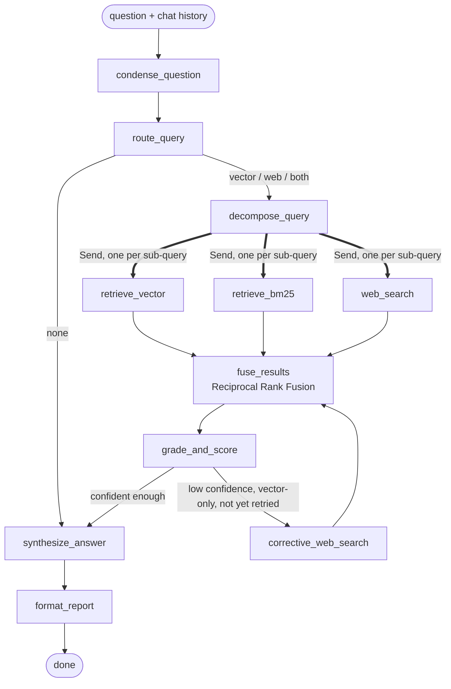

# Adaptive RAG Research Assistant

Ask a research question — then keep the conversation going with follow-ups. The system
resolves follow-up references against the chat history, autonomously decides whether to
retrieve from a local document store, search the web, or both, decomposes compound questions
into sub-queries, retrieves with both dense (vector) and sparse (BM25) search, fuses results
across every retrieval path, checks its own confidence, and falls back to web search when the
local knowledge base comes up short — then synthesizes a cited, transparency-reported answer,
streamed live to the browser as each step of the pipeline runs. The knowledge base ingests
PDF, Word, HTML, Markdown, and text files, or any public web page by URL.

Built with LangGraph, Chroma, and DuckDuckGo web search. Chat/reasoning defaults to Anthropic's Claude when an
`ANTHROPIC_API_KEY` is set, with automatic fallback to Google Gemini (free tier) on error;
Gemini always handles embeddings. No paid services are required — leave `ANTHROPIC_API_KEY`
blank to run entirely on Gemini's free tier.

<!--
  TODO(portfolio polish): drop a screenshot or short GIF of the web UI here, e.g.
  
  A ~3-5 min demo video link (YouTube/Loom) can go right below it.
-->

## Concepts demonstrated

- **Conversational memory / follow-up condensation** — a `condense_question` node rewrites
  follow-ups ("what about their pricing?") into standalone questions before routing, preserving
  what the user literally typed for the transparency panel ("interpreted as: ..."). Synthesis
  also sees recent turns, so answers read as a continuation instead of restarting the topic.
- **Persistent conversations** — every exchange is stored server-side (SQLite, WAL) under a
  conversation id: the server owns the transcript (clients can't forge or truncate history),
  conversations survive restarts, and `GET/DELETE /api/v1/conversations[/{id}]` powers a
  history sidebar in the UI where any conversation can be reopened and continued. Stateless
  callers can pass `save: false` (with an optional inline `history`) to opt out entirely.
- **Agentic / Self-RAG routing** — an LLM router decides per-query whether to hit the local
  knowledge base, the web, both, or neither, before any retrieval happens.
- **Query decomposition** — compound questions are broken into focused, self-contained
  sub-queries that are retrieved independently and fused back together.
- **Hybrid retrieval (dense + sparse)** — every sub-query is retrieved via both a Chroma vector
  store (semantic similarity) and BM25 keyword search over the same corpus, so exact
  names/acronyms that embeddings under-rank still surface.
- **RAG Fusion (Reciprocal Rank Fusion)** — results from every sub-query and every retrieval path
  (vector, BM25, web) are merged and reranked by RRF score, not concatenated or naively
  deduplicated.
- **Confidence scoring / Corrective-RAG** — retrieved documents are graded for relevance; when
  confidence on a vector-only route falls below threshold, the system automatically falls back to
  a web search before answering.
- **Grade-informed reranking** — the relevance grades bought for confidence scoring are reused
  (zero extra LLM calls) to rerank the synthesis context: graded-relevant documents move to the
  front ordered by semantic relevance, graded-irrelevant ones are pruned so they can't pollute
  the answer or earn a citation.
- **Citation-mapped synthesis** — citation markers are assigned deterministically from fused rank
  order in code, not left to the LLM to invent.
- **LangGraph orchestration** — the whole pipeline is a `StateGraph` with conditional edges and
  `Send`-based fan-out for parallel sub-query retrieval, not a linear chain.
- **Streaming + explainability** — the API streams per-node progress over SSE, and every answer
  ships with a structured "Research Summary": route, sub-queries, per-source retrieval counts,
  fused document count, confidence, whether a corrective search fired, and a per-node latency
  breakdown — the same facts the graph already computes, surfaced instead of hidden.
- **RAGAS evaluation harness** — a golden-question dataset scored with non-LLM context
  precision/recall (string/set overlap against reference contexts, not semantic judgment)
  and, optionally, LLM-judged faithfulness/answer relevancy, run explicitly via
  `rag-assistant eval` rather than left unmeasured. The dataset spans every route (`vector`,
  `web`, `both`, `none`), including a case designed to exercise the corrective-fallback loop.
  It's a small (13-question), hand-curated set with no adversarial cases and no naive-RAG
  baseline to compare against — useful as a regression smoke test, not as proof the adaptive
  pipeline outperforms a simpler one.
- **Provider fallback** — a three-tier chain, tried in priority order and skipping any tier
  that isn't configured: a self-hosted local model (when `LOCAL_LLM_BASE_URL` is set), then
  Anthropic Claude (when `ANTHROPIC_API_KEY` is set), then Gemini, wired with
  `.with_fallbacks()` so a rate limit, an outage, or an unreachable GPU box degrades to the
  next tier instead of failing the request. Embeddings always go through Gemini.
- **Self-hosted inference** — the primary tier can be your own hardware on any
  OpenAI-compatible `/v1` endpoint (Ollama, vLLM, LM Studio, llama.cpp), so every graph node
  runs at $0 while the box is reachable and silently falls back to Claude when it isn't. See
  [Running on self-hosted models](#running-on-self-hosted-models).
- **Incremental indexing** — `rag-assistant ingest` hashes file contents against a manifest and
  only re-embeds changed or new files, removing chunks for deleted files, instead of rebuilding
  the whole collection every run (`--full` forces a clean rebuild).
- **Multi-format + URL ingestion** — the corpus accepts PDF (page-aware, markdown-preserving),
  Word (.docx, paragraphs and tables), HTML, Markdown, and plain text, via CLI, drag-and-drop
  upload, or `POST /api/v1/ingest/url`, which fetches any public web page server-side with an
  SSRF guard (every hostname — including each redirect hop's — is resolved and refused if it
  lands on a private/loopback/link-local address) and a streamed size cap.
- **MCP server** — the pipeline doubles as a Model Context Protocol server
  (`rag-assistant mcp`), so Claude Desktop/Code and other MCP clients can research against
  the knowledge base, ingest files/URLs, and browse saved conversations as native tools.
- **Multimodal PDF ingestion (vision)** — charts, diagrams, and photos embedded in PDFs are
  described by the chat provider's vision capability and indexed as `[Figure on page N: ...]`
  blocks beside the page text, so data that exists only as pixels ("EMEA revenue $2.1M" in a
  bar chart) becomes retrievable and citable; pages with no text layer at all (scans) are
  rendered and transcribed by the same mechanism — OCR without an OCR dependency. One vision
  call per figure/scanned page at ingest time, never at query time; size/count budgets cap
  cost, and `PDF_VISION=false` disables it.
- **Live graph execution visualization** — the web UI renders the LangGraph pipeline as a stepper
  that highlights each node as it runs, sourced from the same per-node SSE progress events the
  streaming endpoint already emits.

## Architecture


```mermaid
flowchart TD
    START([question + chat history]) --> condense[condense_question]
    condense --> route[route_query]
    route -- none --> synth[synthesize_answer]
    route -- vector / web / both --> decompose[decompose_query]

    decompose == Send, one per sub-query ==> retrieveVector[retrieve_vector]
    decompose == Send, one per sub-query ==> retrieveBM25[retrieve_bm25]
    decompose == Send, one per sub-query ==> webSearch[web_search]

    retrieveVector --> fuse[fuse_results\nReciprocal Rank Fusion]
    retrieveBM25 --> fuse
    webSearch --> fuse

    fuse --> grade[grade_and_score]
    grade -- low confidence, vector-only, not yet retried --> corrective[corrective_web_search]
    corrective --> fuse
    grade -- confident enough --> synth

    synth --> format[format_report]
    format --> DONE([done])
```

- `retrieve_vector` / `retrieve_bm25` / `web_search` fan out via `Send` — one invocation per
  sub-query, per applicable route — and join back at `fuse_results`.
- `corrective_web_search` loops back into `fuse_results` at most once per question (guarded by
  `correction_attempted` in state, backstopped by a `recursion_limit`).
- Every node is wrapped at registration time to record its own wall-clock latency into
  `node_timings` (an `operator.add`-reduced state field), which is what powers the latency
  breakdown in the Research Summary panel below — instrumentation with no changes to any node's
  own logic.

## Explainability: the Research Summary panel

Every answer — from both `POST /research` and the streaming `POST /research/stream` — carries a
structured summary alongside the prose report:

```json
{
  "route": "vector",
  "condensed_question": "What safety research does Anthropic do?",
  "sub_queries": ["...", "..."],
  "retrieval_counts": { "vector": 16, "bm25": 16, "web": 0 },
  "fused_document_count": 6,
  "confidence_score": 0.62,
  "correction_attempted": false,
  "node_latencies_ms": [{ "node": "route_query", "latency_ms": 1523.7 }, "..."],
  "total_latency_ms": 21026.6
}
```

The web UI renders this as a panel: route, a sub-query checklist, per-source retrieval counts,
the post-fusion unique document count, confidence, whether the corrective fallback fired, and a
latency table grouped by pipeline stage. It exists so the assistant doesn't just produce an
answer — it shows its work, which matters both for debugging and for demoing an agentic system as
something more than "a single LLM call with extra steps."

## Setup

```bash
uv sync
cp .env.example .env
# fill in GOOGLE_API_KEY (https://aistudio.google.com/apikey) in .env
# web search (DuckDuckGo via `ddgs`) needs no key, signup, or billing account -- nothing to
# configure there
# optionally also fill in ANTHROPIC_API_KEY (https://console.anthropic.com/settings/keys) to
# use Claude as the primary chat model, with Gemini as automatic fallback

uv run rag-assistant hello    # confirms chat model connectivity (Anthropic if set, else Gemini)
uv run rag-assistant ingest   # embeds the sample corpus (data/corpus/) into Chroma, incrementally
```

Or run the API + Redis via Docker Compose instead:

```bash
docker compose up --build   # api on http://localhost:8000, redis alongside it
```

> **Free-tier quota note:** if `ANTHROPIC_API_KEY` is unset, chat calls fall back to Gemini,
> whose free tier caps at ~20 requests/day; one research question costs ~4 calls (route,
> decompose, grade, synthesize) plus embedding calls (embeddings always go through Gemini
> regardless of the chat provider). Budget accordingly when running `ask`, `serve`, or `eval`
> repeatedly in a single day.

## Usage

### CLI

```bash
uv run rag-assistant ask "Who founded Anthropic and what is their safety research called?"
uv run rag-assistant ask "What is the most recent Claude model release?"
uv run rag-assistant ask "Compare Anthropic and Mistral AI's founding stories and safety focus."
```

`ingest` is incremental by default: it hashes each file in `data/corpus/` against a manifest and
only re-embeds new or changed files, removing chunks for any file that's been deleted since the
last run. Pass `--full` to reset the collection and re-embed everything from scratch:

```bash
uv run rag-assistant ingest --full
```

Debug commands for individual pieces of the pipeline:

```bash
uv run rag-assistant retrieve "anthropic founders" --k 4   # raw vector-store retrieval
uv run rag-assistant search "claude model releases 2026"   # raw DuckDuckGo web search
```

Operator commands:

```bash
uv run rag-assistant backup --keep 7          # snapshot index + corpus + conversations
uv run rag-assistant restore <archive.tar.gz> # roll back to a snapshot
uv run rag-assistant loadtest --requests 500 --concurrency 25
```

### API

```bash
uv run rag-assistant serve   # starts FastAPI on http://127.0.0.1:8000
```

```bash
curl -X POST http://127.0.0.1:8000/api/v1/research \
  -H "Content-Type: application/json" \
  -d '{"question": "Who founded Anthropic and what is their safety research called?"}'
```

```bash
curl -N -X POST http://127.0.0.1:8000/api/v1/research/stream \
  -H "Content-Type: application/json" \
  -d '{"question": "Who founded Anthropic and what is their safety research called?"}'
```

`/api/v1/research/stream` emits Server-Sent Events — one `"progress"` frame per graph node as it
completes, then a final `"done"` frame carrying the report and the Research Summary above (or a
`"error"` frame on failure, since the HTTP status is already 200 by the time streaming starts).

Conversations are persisted server-side: the first request returns a `conversation_id`, and
follow-ups just send it back — the server loads its own transcript, condenses the follow-up
against it, and appends the new exchange:

```bash
curl -X POST http://127.0.0.1:8000/api/v1/research \
  -H "Content-Type: application/json" \
  -d '{"question": "what about their safety research?", "conversation_id": "<id from the first response>"}'
```

`GET /api/v1/conversations` lists them, `GET /api/v1/conversations/{id}` returns the full
transcript (including each answer's report and research summary), and `DELETE` removes one.
For fully stateless use, pass `"save": false` and (optionally) an inline `history` of
`{"role", "content"}` turns instead.

Ingest a public web page into the knowledge base by URL:

```bash
curl -X POST http://127.0.0.1:8000/api/v1/ingest/url \
  -H "Content-Type: application/json" \
  -d '{"url": "https://en.wikipedia.org/wiki/Retrieval-augmented_generation"}'
```

Every endpoint is under `/api/v1/`. The original unversioned `/research` and
`/research/stream` remain registered as deprecated aliases so clients written before
versioning keep working; they are hidden from the OpenAPI schema and carry the same rate
limits as the versioned paths.

Interactive API docs at `http://127.0.0.1:8000/docs`.

### Observability

```bash
curl http://127.0.0.1:8000/metrics        # Prometheus exposition
curl http://127.0.0.1:8000/ready          # dependency-aware readiness (503 when Chroma or web search is down)
```

Useful queries once a Prometheus is scraping it:

```promql
# p95 latency of a research call
histogram_quantile(0.95, sum by (le) (rate(rag_http_request_duration_seconds_bucket{route="/api/v1/research"}[5m])))

# is the primary LLM provider failing over?
sum by (provider, outcome) (rate(rag_llm_calls_total[5m]))

# output tokens per hour, by model -- the cost signal
sum by (model) (rate(rag_llm_tokens_total{kind="output"}[1h])) * 3600

# cache hit rate
sum(rate(rag_cache_operations_total{result="hit"}[5m])) / sum(rate(rag_cache_operations_total{result=~"hit|miss"}[5m]))
```

With `API_KEYS` set, `/metrics` requires a key like any other protected route — point the
scraper at it with an `X-API-Key` header, or set `METRICS_ENABLED=false` to remove the route.

Alert rules and a Grafana dashboard ship in `ops/`:

```yaml
rule_files:
  - ops/prometheus/alerts.yml   # then import ops/grafana/dashboard.json
```

`tests/test_ops_artifacts.py` asserts every metric they reference actually exists. Monitoring
config rots silently, and an alert that can never fire is worse than no alert because its
presence is taken as coverage. Two things are deliberately not alerted on: cache hit rate (a
cache outage is slower and costlier, never wrong) and absolute token spend (what matters is a
change in the *rate*, which the burn-rate rule catches without anyone guessing a budget).

### Web UI

The UI carries two controls tied to the features above: a **source filter** above the input,
which lists what `GET /api/v1/sources` reports this caller can retrieve from and narrows local
retrieval to the files you tick (web search is unaffected), and **thumbs up/down under each
answer**, which posts to `/api/v1/feedback`. A downvote reveals an optional note field — the
rating is recorded immediately either way, because demanding a note before accepting the rating
would cost most of the ratings.

A React + Vite single-page app in `frontend/` streams `/api/v1/research/stream` live as a
conversation: each turn shows the question, the streamed report, and its own collapsible
Research Summary, and follow-ups automatically carry the transcript. A graph visualization
stepper highlights each LangGraph node as it runs (grouping the fanned-out `retrieve_vector`
/ `retrieve_bm25` / `web_search` nodes into one "Retrieve" stage with per-source counts, and
marking `corrective_web_search` as skipped when the confidence gate doesn't trigger it). The
corpus drawer accepts drag-and-drop uploads (PDF/DOCX/HTML/MD/TXT) and web page URLs.

```bash
uv run rag-assistant serve       # terminal 1 -- backend on http://127.0.0.1:8000

cd frontend
npm install
npm run dev                      # terminal 2 -- UI on http://localhost:5173
```

The backend allows CORS from `http://localhost:5173` by default. If the backend runs elsewhere,
copy `frontend/.env.example` to `frontend/.env` and set `VITE_API_BASE_URL`.

### MCP server (use it from Claude Desktop / Claude Code)

The whole pipeline is also exposed as an [MCP](https://modelcontextprotocol.io) server, so any
MCP client can use the knowledge base as a tool — ask Claude Desktop a question and it calls
`research_question` behind the scenes, cited answer and all:

```bash
uv run rag-assistant mcp   # stdio transport; normally launched by the client, not by hand
```

Tools exposed: `research_question`, `ingest_file`, `ingest_url`, `list_documents`,
`list_conversations`. Claude Desktop config (`claude_desktop_config.json`):

```json
{
  "mcpServers": {
    "adaptive-rag": {
      "command": "uv",
      "args": ["run", "--directory", "/absolute/path/to/this/repo", "rag-assistant", "mcp"]
    }
  }
}
```

The server runs in-process on your machine (no HTTP hop, logs on stderr so the stdio protocol
stream stays clean) under your own `.env` credentials.

### Deploying a live demo

The Docker image builds the frontend and serves it from FastAPI itself (`STATIC_DIR`), so one
container is the whole app. `render.yaml` is a ready-made [Render](https://render.com)
blueprint: connect the repo ("New" → "Blueprint"), set `GOOGLE_API_KEY` (and optionally
`ANTHROPIC_API_KEY`) when prompted, and the free instance serves the full demo — the baked-in
sample corpus is indexed at container startup. Any other Docker host works the same way:

```bash
docker build -t rag-assistant .
docker run -p 8000:8000 --env-file .env rag-assistant   # full app on http://localhost:8000
```

### Evaluation

Two layers, because they answer different questions and only one of them can gate a build.

**Deterministic retrieval metrics** — computed from graph output, no judge, no extra model
calls, identical numbers on identical output:

| Metric | What regressing means |
| --- | --- |
| `route_accuracy` | The router started sending questions down the wrong retrieval path |
| `source_recall` | The right documents stopped being retrieved at all |
| `mean_reciprocal_rank` | The right documents are still found, but ranked lower |
| `abstention_accuracy` | The system started answering things it can't support — or refusing things it can |

**RAGAS** (`--llm-judge`) adds faithfulness and answer relevancy. Kept out of the gate on
purpose: it costs model calls per row and its scores drift slightly between runs on identical
output, so gating on it would fail builds for reasons unrelated to the change.

```bash
uv run rag-assistant eval --limit 28                    # score the full dataset
uv run rag-assistant eval --limit 28 --llm-judge        # ...plus RAGAS faithfulness/relevancy
uv run rag-assistant eval --limit 28 --record-baseline  # record baseline from a known-good build
uv run rag-assistant eval --limit 28 --check            # fail on regression vs. that baseline
```

`--check` compares against `data/golden_eval/baseline.json` with a tolerance (default 0.05),
rather than against absolute thresholds. Absolute numbers get set to whatever today's run
produced and then either block unrelated work or get quietly lowered until they block nothing;
a baseline asks the question that matters — *did this change make retrieval worse than it was?*
The tolerance absorbs a single borderline routing flip, since LLM routing isn't deterministic
even at temperature 0, and a gate that fails on noise is a gate people learn to ignore.

**Record your own baseline before the gate does anything.** No baseline ships with the repo:
the numbers depend on which chat provider you configured, so a committed one would be a
fiction on anyone else's setup. Run `--record-baseline` once against a build you trust and
commit `data/golden_eval/baseline.json` — that is what switches the CI gate on. Until then
CI reports the gate as skipped with a warning rather than failing, since failing red on a
fresh clone just teaches everyone to ignore the job. Re-record deliberately when a change is
a genuine improvement, never to make a failing gate pass.

The dataset (`data/golden_eval/dataset.jsonl`) is 28 questions across five categories —
`factual`, `multi_hop`, `unanswerable`, `current`, `no_retrieval`. The `unanswerable` rows
carry the most weight: a dataset of only answerable questions cannot catch the failure that
matters most in RAG, which is answering confidently from documents that don't contain the
answer. It is still small and hand-authored, with no baseline system to compare against.

### Retrieval tuning

Three knobs, all off by default, because each trades cost or a dependency for quality. Turning
any of them on is a configuration change — none requires a re-index except where noted.

| Setting | What it changes | What it costs |
| --- | --- | --- |
| `CHUNKING_STRATEGY=semantic` | Splits a section where consecutive sentences stop being similar, instead of every N characters. Fixed-size splitting routinely severs a claim from the sentence that qualifies it | One embedding call per section at ingest. Re-indexes automatically (`CHUNKING_VERSION`) |
| `PARENT_CONTEXT=true` | Small-to-big: retrieve on precise chunks, then hand synthesis the whole section each winner came from. Retrieval wants small chunks for precision, synthesis wants large ones for context — this refuses the trade | More of the context budget per document. No re-index: sections are always recorded |
| `RERANKER=cohere` / `cross_encoder` | Scores (query, document) pairs jointly. RRF ranks by retriever *consensus* and never compares a document against the question, so a passage every path returns for lexical reasons outranks the one that answers it | An API key, or `sentence-transformers` (torch). Both are optional extras |

```bash
uv sync --extra rerank-cohere   # RERANKER=cohere, needs COHERE_API_KEY
uv sync --extra rerank-local    # RERANKER=cross_encoder, pulls in torch
```

Requests can also narrow local retrieval by metadata. Filters are pushed into the query rather
than applied to the results — post-filtering silently shrinks `k`, and the graph reads a short
result as "the corpus has nothing" and falls back to web search:

```bash
curl -X POST http://127.0.0.1:8000/api/v1/research \
  -H "Content-Type: application/json" \
  -d '{"question": "What is their safety approach?",
       "filters": {"sources": ["anthropic.md"], "ingested_after": "2026-01-01T00:00:00Z"}}'
```

### Feedback

`POST /api/v1/feedback` records a thumbs up/down against an answer; the web UI shows the
buttons under each one. `GET /api/v1/feedback/summary` returns the counts and — the useful part
— the recently downvoted questions.

Those questions are the material a golden eval dataset goes stale for lack of. The gate below
catches regressions against a *fixed* set of questions; it cannot tell you the set stopped
resembling what people actually ask. This is the only signal here sourced from a human rather
than from the system's own behaviour, which is why it is also the only alert of its kind.

### Backup and restore

```bash
uv run rag-assistant backup --output backups/ --keep 7
uv run rag-assistant restore backups/rag-assistant-backup-<timestamp>.tar.gz
```

One archive holds the vector index, the ingestion manifest, the conversation database and the
corpus — everything that isn't in git. Two design points worth stating, because both are places
a naive implementation is quietly wrong:

- **SQLite goes through SQLite's online backup API, not `cp`.** In WAL mode the committed data
  lives across `.db`, `.db-wal` and `.db-shm`, and copying the three catches them at different
  instants — producing an archive that restores, opens without complaint, and is missing recent
  writes. The `-wal`/`-shm` sidecars are deliberately *not* copied, because the snapshot has
  already folded them in.
- **Restore stages the whole archive before swapping anything**, and moves the existing data
  aside rather than deleting it. A corrupt or truncated archive fails with the live deployment
  untouched, instead of halfway replaced. Archives are also checked for path-traversal members,
  since a restore runs wherever the operator happens to be.

Caches are process-local, so restart the server afterwards — the CLI says so.

### Scaling out

The default is one container with no infrastructure, and that is a deliberate constraint rather
than a limitation nobody noticed: embedded Chroma locks its SQLite file to one process, the
ingest task registry is in-memory, and conversations are SQLite. The image pins `--workers 1`
for exactly that reason.

Each of those ceilings is now a setting rather than a rewrite:

| Setting | Removes |
| --- | --- |
| `CHROMA_SERVER_HOST` | The vector index's file lock — replicas share a Chroma server |
| `TASK_BACKEND=redis` | Per-process ingest tasks. Without it a client polling a load-balanced deployment gets "unknown ingest task" from every replica that didn't accept the upload |
| `CONVERSATIONS_BACKEND=postgres` + `DATABASE_URL` | SQLite's single-writer lock, the main obstacle to a second replica. Needs `uv sync --extra postgres`; migrations are advisory-locked so replicas can start simultaneously |

The Postgres backend is verified against a real Postgres in `tests/test_postgres_store.py`,
which skips unless `RAG_TEST_DATABASE_URL` points at one:

```bash
initdb -D /tmp/pg/data -U postgres --auth=trust
pg_ctl -D /tmp/pg/data -o "-p 55432 -k /tmp/pg" -l /tmp/pg/log start
RAG_TEST_DATABASE_URL=postgresql://postgres@127.0.0.1:55432/postgres uv run pytest tests/test_postgres_store.py
```

### Load testing

```bash
uv run rag-assistant loadtest --requests 500 --concurrency 25          # /health, free
uv run rag-assistant loadtest --question "Who founded Anthropic?"      # real pipeline, costs LLM calls
```

Defaults to `/health` on purpose: that exercises the HTTP stack, middleware chain and event
loop for nothing, while pointing it at the research endpoint is a real bill and the CLI prints
the estimate first. It reports p50/p95/p99 and never a mean — an average hides exactly the tail
that matters.

Measured on a laptop, single worker, concurrency 25: **376 rps on `/health`** and **407 rps on a
SQLite-backed endpoint**, p95 172ms and 109ms, no errors.

### Running on self-hosted models

Any OpenAI-compatible `/v1` endpoint works — Ollama (`:11434/v1`), vLLM (`:8000/v1`), LM Studio,
llama.cpp. Setting `LOCAL_LLM_BASE_URL` makes it the primary chat/reasoning provider; Anthropic
and Gemini stay configured behind it as automatic fallbacks.

Get the real model list from the box rather than guessing at names:

```bash
curl http://<host>:11434/api/tags | jq -r '.models[].name'   # Ollama
curl http://<host>:8000/v1/models                            # vLLM
```

Then:

```bash
LOCAL_LLM_BASE_URL=http://<host>:11434/v1
LOCAL_LLM_CHAT_MODEL=<one of the names above>
```

```bash
rag-assistant hello     # prints "Local (<model>) says: ..." when it's actually being used
curl localhost:8000/ready | jq .local_llm
```

Two things worth knowing:

- **Reachability is a property of the server, not your laptop.** If the box is on a tailnet or a
  VPN, use the MagicDNS/hostname rather than the raw `100.x` IP — the IP is stable per node but
  the name survives a node being removed and re-added. And a Render/Fly/Vercel deploy is not on
  your tailnet: leave `LOCAL_LLM_BASE_URL` blank in those environments, or accept that every
  call pays a 2s connect timeout before falling through to Claude.
- **`/ready` reports the local endpoint but doesn't fail on it.** An unreachable box is a cost
  and latency regression, not an outage — the graph still answers on Claude — so it shouldn't
  pull a healthy replica out of a load balancer. It's surfaced because "the bill moved because a
  route dropped" is exactly the failure you want to be able to see.

## Example questions per concept

| Concept | Example question |
| --- | --- |
| Vector routing | "Who founded Anthropic and what is their safety research called?" |
| Web routing | "What is the most recent Claude model release?" |
| No retrieval (general knowledge) | "What is the capital of France?" |
| Query decomposition | "Compare Anthropic and Mistral AI's founding stories and safety focus." |
| Corrective fallback | "What safety research did Anthropic publish this week?" (recent/narrow enough that the local corpus alone often scores low, triggering a web search fallback) |

## Design decisions

**Why is the local model the *primary* provider rather than a fallback behind Claude?**
Because the point is cost, and a fallback never gets called on the happy path. The order is
local → Anthropic → Gemini, and every tier that isn't configured is skipped without being
constructed (the Gemini client validates its key in `__init__`, so merely *building* it as an
unused fallback crashes an Anthropic-only deployment). The degradation this buys is the useful
kind: a laptop on the tailnet answers for free, and the same image deployed to a host with no
route to the box answers on Claude without a config change.

**Why a short connect timeout but a long read timeout on the local provider?** They're solving
opposite problems. Local generation is genuinely slow — a 26B model on one GPU takes 20-25s for
a real answer — so the read timeout is 180s. But off the tailnet there is no route to the box
at all, and a connect that hangs would burn the whole `GRAPH_TIMEOUT_SECONDS` budget before
Anthropic ever saw the call. A 2s connect timeout is what turns "unreachable box" into a fast
failover instead of a dead request. One retry, not zero: single-model Ollama returns a transient
500 while swapping models, and that one is worth absorbing.

**Why can't `with_structured_output(method="json_schema")` be used on a local server?**
`langchain_openai` routes that method through OpenAI's Structured Outputs parser, which reads a
`parsed` field only hosted OpenAI populates. Against Ollama or vLLM it raises
`"response does not have a 'parsed' field"` on *every* call — including calls where the server
returned perfectly valid JSON — so every structured node in the graph would fail through to the
paid fallback while looking like a local-model quality problem. The schema is bound as
`response_format` by hand (the half that matters: the server constrains decoding) and parsed
back off `content` like every other provider. See `_local_structured_runnable` in `llm.py`.

**Why does the graph tolerate a local model returning an empty answer?** It doesn't — that's the
bug it's built to avoid. Reasoning models (Qwen3-class) sometimes leave `content` empty and put
the whole answer in a `reasoning`/`reasoning_content` field, which `langchain_openai` discards
because it isn't in the OpenAI schema. Downstream that reads as "the model said nothing": an
empty synthesis, or a structured parse failure. `_LocalChatOpenAI` recovers it from the raw
payload on both the blocking and the streaming path (the synthesis node streams, so handling
only one of them would still relay a stream of empty SSE tokens). Truncation at `max_tokens`
with nothing in `content` is treated differently — that's a config problem, not an answer, so it
raises and lets the fallback chain answer while the error stays visible in the logs.

**Why do embeddings stay on Gemini when chat can go local?** Chat providers are interchangeable
mid-flight; embeddings are not. The Chroma collection is built at one provider's vector
dimension, and pointing queries at a different embedding model doesn't error — it silently
returns nonsense neighbours. Switching would require a full re-index
(`rag-assistant ingest --full`), so it's a deliberate one-way decision rather than something the
graph can fall back into at runtime.

**Why hybrid (vector + BM25) retrieval, not vector-only?** Dense embeddings are strong on
semantic/paraphrased queries but can under-rank exact keyword matches — model names, acronyms,
proper nouns — that a small corpus makes easy to miss entirely if the wording doesn't line up.
BM25 costs nothing extra to add (`rank_bm25`, no external service, rebuilt in-memory from the
same chunks that get embedded) and only ever adds candidates into fusion; it never replaces the
vector path.

**Why Reciprocal Rank Fusion over an LLM-based reranker?** RRF is a pure, deterministic function
of rank position across ranked lists — no additional model call, no added latency, no added
quota cost — and is a well-established way to combine heterogeneous retrieval paths (vector,
BM25, web) without having to calibrate their scores onto a common scale.

**Why Corrective-RAG (confidence-gated web fallback) instead of always searching the web?**
Always searching the web on every question would add latency even when the
local corpus already answers confidently. Gating the fallback on a relevance-graded confidence
score means the web search only fires when the vector-only route is actually falling short —
demonstrating self-assessment rather than blind escalation.

**Why SSE streaming instead of a single blocking response?** The graph can take 10-20+ seconds
end-to-end (multiple sequential LLM calls plus fanned-out retrieval). A blocking response gives
no feedback during that window; `stream_mode="updates"` gives per-node progress essentially for
free, since LangGraph already emits these events — the only added work is reshaping them into SSE
frames.

**Why RAGAS for evaluation instead of eyeballing answers?** Manually judging "is this answer
good" doesn't scale and isn't repeatable across changes to prompts or retrieval. RAGAS's
non-LLM metrics (`NonLLMContextPrecisionWithReference`, `NonLLMContextRecall`) score retrieval
quality against a golden dataset with zero additional LLM calls, so regressions in retrieval can
be caught without spending quota — LLM-judged metrics (faithfulness, relevancy) are opt-in for
when that extra cost is worth it.

## Authentication & multi-tenancy

Set `API_KEYS` (comma-separated `label:key` entries) and every data/LLM endpoint requires
`X-API-Key: <key>` (or `Authorization: Bearer <key>`); the web UI shows an access-key gate.
Each key's label is a tenant: conversations are stored, listed, and deletable only within it
(a foreign conversation id 404s identically to a nonexistent one), and rate limits are keyed
per tenant rather than per IP. Leave `API_KEYS` blank to run fully open (local development /
public demo mode) — everything then belongs to the shared `public` tenant. `/health`,
`/ready`, the docs, and the static frontend stay open either way. Behind a load balancer the
Docker CMD passes `--proxy-headers --forwarded-allow-ips '*'` so anonymous rate limiting keys
on the real client IP, not the LB's. Set `SENTRY_DSN` to capture unhandled exceptions.

For anything beyond a demo, `API_KEYS_FILE` points at a JSON file that expresses what a
comma-separated env var cannot — a key that only reads, one that stops working in March, one
allowed more requests than the rest:

```json
{"keys": [
  {"key": "sk-live-a1b2", "owner": "alice", "scopes": ["read", "write"],
   "expires_at": "2026-12-31T23:59:59Z", "rate_limit_rpm": 120},
  {"key": "sk-ro-c3d4", "owner": "reporting", "scopes": ["read"]}
]}
```

Writes (`POST /api/v1/ingest*`, `DELETE /api/v1/conversations/*`) need the `write` scope;
everything else needs `read`. A valid key without the scope gets **403, not 401** — 401 would
tell a read-only client to re-authenticate, which presenting the same key again cannot fix.
Every decision is audited with the key's fingerprint, never the key: an audit trail that
records secrets is a secret store nobody is guarding. The key cache is keyed on the file's
mtime, so editing it revokes or rotates a credential on the next request rather than the next
restart — the difference between revocation being an operation and being an outage.

**The knowledge base is tenant-scoped too**, not just conversations. Ownership lives in the
corpus layout rather than a sidecar table, because the layout is the thing that survives — a
manifest can be deleted, reset by a fresh deploy, or drift from the files on disk, and every
one of those failures defaults documents to visible-to-everyone, which is the wrong direction
to fail in:

```
data/corpus/anthropic.md           # public — the shared baseline corpus, everyone sees it
data/corpus/_t/alice/report.md     # private to tenant "alice"
```

Uploads land in the uploading tenant's subtree; flat files stay public, so an open demo's
on-disk layout is exactly what it was before tenancy existed and the baked-in corpus needs no
migration. Both retrieval paths filter on ownership — Chroma via a `$in` filter applied
*during* search (post-filtering would silently shrink `k`, so a tenant whose top hits belong
to someone else would get fewer documents with no indication why), BM25 by narrowing
candidates before the top-k cut. The router's corpus description is scoped as well: listing
another tenant's filenames would leak them through the prompt even though retrieval filters
them out.

Ingestion is scoped the same way. An upload re-indexes only the uploading tenant's scope, and
within it only files whose bytes actually changed — decided from a raw-byte fingerprint, so
the check never runs the parse it exists to avoid. Removal detection is scoped to the same
slice, since comparing one tenant's scan against the whole manifest would read every other
tenant's documents as deleted and drop their chunks. A full rebuild (`ingest --full`) refuses
to be scoped to one owner at all, because resetting the collection would delete everyone else's.

The measured effect on a 8-file corpus, one tenant uploading one file: **16 file parses → 1.**
Most of that came from a second, less obvious source — the BM25 index used to rebuild by
re-reading and re-splitting the entire corpus from disk after every ingest. It now builds from
the chunks already stored in Chroma, which removes the second parse pass and, more usefully,
makes the two retrieval paths index the identical chunk set *by construction* rather than by
the convention that both happened to call the same splitter. The tradeoff is that keyword
search reflects what has been indexed rather than what is on disk — which is the honest
behaviour, since an un-ingested file was always invisible to vector search.

## Production readiness

Beyond the core RAG pipeline, the API is hardened for running as an actual service rather than a
local demo script:

| Area | What's there |
| --- | --- |
| Containerization | Multi-stage `Dockerfile` (non-root user), `docker-compose.yml` wiring `api` + `redis` with a named volume for the Chroma persist directory. Embedded Chroma's SQLite backing locks the file to one process, which is why the image pins `--workers 1`; `CHROMA_SERVER_HOST` switches to server mode when that ceiling matters (see [Scaling out](#scaling-out)) |
| Health & readiness | `GET /health` is a pure liveness check; `GET /ready` actually pings Chroma (`_collection.count()`) and DuckDuckGo (`HEAD` request) and returns 503 if either dependency is down, so an orchestrator can distinguish "process is up" from "can actually serve a request" |
| Input validation | `question` is required, capped at 2000 chars, HTML-tag-stripped, and rejected as gibberish if under 10% alphanumeric — all in a pydantic `field_validator`, so bad input 422s before it ever reaches the graph |
| Rate limiting | `slowapi`-based, both per-IP (`RATE_LIMIT_RPM`, default 10/min) and a global cap (`RATE_LIMIT_RPM_GLOBAL`, default 30/min) across `/research` and `/research/stream` |
| Timeouts | The web search client is capped at `WEB_SEARCH_TIMEOUT_SECONDS` (default 10s); the whole graph execution behind `/research/stream` is bounded by `GRAPH_TIMEOUT_SECONDS` (default 45s) via a monotonic-clock deadline around `astream()`, emitting an `"error"` SSE frame and closing the connection instead of hanging indefinitely |
| Graceful shutdown | SIGTERM is caught via `loop.add_signal_handler` inside the FastAPI lifespan; active SSE connections (tracked in a `weakref.WeakSet`) are sent a `"close"` frame before the process exits, instead of being cut off mid-stream |
| Structured logging | JSON logs (`python-json-logger`) with a UUID4 `trace_id` generated per request by an ASGI middleware, propagated through `contextvars` *and* threaded explicitly into the LangGraph state (belt-and-suspenders, since LangGraph's internal scheduling isn't guaranteed to preserve context automatically) — every log line, including each node's completion log, carries `trace_id`/`node`/`route`/`latency_ms`, and the response carries the same trace ID in an `X-Trace-Id` header |
| Caching | Redis-backed, best-effort (`USE_CACHE=false` or any Redis error both degrade silently to "no cache" — a cache outage is never worse than having no cache): router decisions keyed by question (`CACHE_TTL_ROUTER`, 5min), web search results keyed by query (`CACHE_TTL_WEB_SEARCH`, 10min), synthesized answers keyed by question + route + fused source IDs (`CACHE_TTL_SYNTHESIS`, 30min) — all under a `v1:` key prefix so a payload-shape change can be rolled out by bumping the prefix rather than migrating existing entries |
| Configuration | All of the above is `pydantic-settings`-driven (`config.py`), reading exclusively from environment variables with fail-fast validation at startup instead of scattered `os.environ.get()` calls with silent defaults |
| Metrics | Prometheus exposition at `GET /metrics` (`metrics.py`): request rate/latency by *templated* route, LLM calls and **token usage** by provider/model/outcome, cache hit-rate by namespace, per-node graph latency, graph outcomes split `ok`/`error`/`timeout`, and a live SSE-connection gauge. Every label is drawn from a bounded set — the route label is Starlette's path template, never the UUID-bearing real path, and unmatched requests collapse to one sentinel series, so a scanner hitting random URLs can't blow up the registry. The token counter is the one that maps onto money: it's how a provider fallback shows up as a cost change rather than a surprise at the end of the month |
| Schema migrations | The conversation store applies an ordered, append-only migration list stamped via `PRAGMA user_version` (`conversations/store.py`), each in its own transaction so a failure mid-chain resumes rather than replays. The baseline migration is written to converge all three databases that predate versioning — brand new, pre-`owner`-column, and already-ALTERed — onto one shape |
| Data retention | Conversations are bounded by both an age cutoff (`CONVERSATION_RETENTION_DAYS`, 90d) and a per-tenant count cap (`CONVERSATION_MAX_PER_OWNER`, 500), pruned inline after each write and scoped to the tenant that wrote, so no cron is needed and the sweep never scans other tenants. Messages follow via `ON DELETE CASCADE` |
| CORS | Origins come from `CORS_ALLOW_ORIGINS` rather than being hardcoded, so a split deploy (UI on Vercel, API on Render) is configuration rather than a code change; the single-container deploy is same-origin and needs none. `X-Trace-Id` is in `expose_headers` so a cross-origin frontend can actually read the trace ID it's meant to report |
| API versioning | Everything is under `/api/v1/`; the pre-versioning `/research` and `/research/stream` stay registered as deprecated, schema-hidden aliases carrying the same rate limits, so older clients keep working without the docs showing two ways to do one thing |
| Supply chain | CI audits Python dependencies (`pip-audit` over the exported lockfile) and npm dependencies, and scans the built image with Trivy. Reported rather than blocking, since a fresh advisory against a transitive dependency shouldn't block unrelated work behind a fix nobody has published yet |
| Deploy verification | The docker CI job doesn't stop at "the image builds" — it runs the real image and waits on `/health`, so a container that builds and then crashes on boot fails CI instead of failing the deploy. Both the image and compose file carry healthchecks (compose uses `/ready`, which actually pings Chroma and web search) |
| Single-worker constraint | `--workers 1` is stated explicitly in the Dockerfile CMD with the reasoning, rather than left to uvicorn's default: embedded Chroma locks its SQLite file to one process, and the ingest task registry and conversation write lock are per-process. Made explicit so nobody "optimizes" it into `--workers $WEB_CONCURRENCY` and gets intermittent 404s and database-locked errors |
| Retrieval quality gate | `rag-assistant eval --check` scores the golden dataset on deterministic, judge-free metrics (route accuracy, source recall, MRR, abstention accuracy) and fails against a recorded baseline. CI runs it on every push where API keys are available. This is the gate for the failure mode nothing else catches: a prompt or chunking change that raises no exception and fails no unit test, because the system keeps returning confident prose about the wrong documents |
| Adversarial eval coverage | The dataset carries `unanswerable`, `multi_hop`, `no_retrieval` and `current` rows alongside the happy path, so abstention is scored as a first-class metric — a dataset of only answerable questions cannot catch confidently answering something the corpus doesn't contain |
| Context budget | Synthesis is capped at `SYNTHESIS_CONTEXT_BUDGET_TOKENS` (see `graph/context_budget.py`). Fusion's output scales with (sub-queries x retrieval paths), not with the question, so an uncapped prompt grows with retrieval breadth until it overflows the context window — at the very end of the pipeline, after every retrieval and grading call has been paid for. Documents arrive ranked, so the cap drops what the pipeline already judged least useful, truncates rather than drops the top document, and surfaces the count in the research summary |
| Structure-aware chunking | Splitting follows markdown headings first and fixed-size only within a section, prepending the heading breadcrumb to every chunk (`ingestion/splitter.py`). A chunk reading "It raised $450M in a Series C" is nearly useless to both retrieval paths — no company in the embedding, no company token for BM25. The breadcrumb is charged against `chunk_size`, so it stays a real bound, and `CHUNKING_VERSION` in the manifest makes a strategy change re-index itself instead of silently serving chunks built by the previous splitter |
| Corpus tenant isolation | Ownership is encoded in the corpus layout (`ingestion/ownership.py`): flat files are the shared public corpus, `_t/<owner>/` is private to that tenant. Both retrieval paths filter on it — Chroma via a `$in` filter applied *during* search rather than after (post-filtering silently shrinks k), BM25 by narrowing candidates before the top-k cut. The router's corpus description is scoped too, since listing another tenant's filenames leaks them through the prompt even when retrieval filters them out |
| Incremental ingestion cost | Re-indexing is decided from a raw-byte fingerprint plus `CHUNKING_VERSION`/`LOADER_VERSION`, so unchanged files are never parsed — not merely never re-embedded. That distinction is the whole cost: a parse runs pymupdf4llm and, with `PDF_VISION` on, a vision API call per figure and per scanned page. Ingestion is also scoped to the uploading tenant. One upload into an 8-file corpus went from 16 file parses to 1 |
| BM25 / vector chunk parity | The keyword index is built from the chunks stored in Chroma rather than by re-reading the corpus. Beyond removing a second full parse pass per ingest, it makes RRF's `SHA256(content)` cross-source dedup correct by construction — previously the two paths produced identical text only by the convention that both called the same splitter, and any drift would have silently double-counted and double-cited the same passage |
| Backup & restore | One archive holds the index, manifest, conversations and corpus. SQLite goes through SQLite's online backup API rather than a file copy — in WAL mode a `cp` of `.db`/`-wal`/`-shm` catches them at different instants and restores into a database that opens cleanly and is missing recent writes. Restore stages the whole archive before swapping and moves the existing data aside rather than deleting it, so a corrupt archive fails with the deployment untouched |
| Embedding-model drift | The model the index was built with is recorded and checked by `/ready`. This is the one dependency whose failure is *silent*: a changed model with the same dimension embeds queries into a space the stored vectors don't occupy and returns plausible nonsense with no error anywhere. Readiness failing pulls the replica from the load balancer instead |
| Key management | Scopes (`read`/`write`, 403 not 401), expiry, per-key rate limits, and an audit trail recording key fingerprints and never keys. The key cache is keyed on the key file's mtime, so revocation takes effect on the next request rather than the next restart |
| Horizontal scaling | Every single-process ceiling is a setting rather than a rewrite: `CHROMA_SERVER_HOST` (vector index file lock), `TASK_BACKEND=redis` (per-process ingest tasks), `CONVERSATIONS_BACKEND=postgres` (SQLite's single-writer lock). Defaults keep a single container infrastructure-free; the Postgres backend is verified against a real Postgres, with advisory-locked migrations so replicas can start at once |
| Alerting | Prometheus rules and a Grafana dashboard in `ops/`, with tests asserting every metric they reference exists. Thresholds are stated with their reasoning — an alert whose number nobody can justify is one that gets silenced the first time it fires at 3am |
| Load testing | `rag-assistant loadtest` reports p50/p95/p99 and never a mean. Measured single-worker at concurrency 25: 376 rps on `/health`, 407 rps on a SQLite-backed endpoint, p95 172ms/109ms, no errors |
| Quality signal | Thumbs up/down per answer, surfacing recently downvoted questions. The eval gate catches regressions against a fixed dataset; only this can tell you the dataset stopped resembling what people ask |

## Self-audit: findings & fixes

A structured pass through routing, retrieval, corrective RAG, citations, evaluation, and
streaming — the kind of review that unit tests alone don't catch — surfaced real gaps beyond
happy-path correctness. Fixed:

| Area | Finding | Fix |
| --- | --- | --- |
| Vector store | Chroma had no explicit distance metric, silently defaulting to L2 while Gemini embeddings are meant to be compared via cosine similarity | Set `hnsw:space: cosine` explicitly and rebuilt the index (`ingest --full`) |
| Web search resilience | A web-search outage/rate-limit raised unhandled and crashed the graph node | `WebSearchTool.search` now catches the failure and degrades to `[]` |
| Answer synthesis | An empty `fused_documents` was treated as one case ("no retrieval needed"), but it also happens when retrieval is attempted and comes back empty — same prompt, very different risk of confident hallucination | Split into `NO_CONTEXT_PROMPT` (route == `none`) vs. `EMPTY_RETRIEVAL_PROMPT` (retrieval ran, found nothing), which forces the model to state upfront that no sources were found |
| Non-streaming API | `/research` only caught `RuntimeError`; any other exception fell through to a bare, contentless 500 | Broadened to `except Exception`, still raised as a proper `HTTPException` with `detail` |
| Documentation | README implied RAGAS's semantic, LLM-judged `context_precision`/`context_recall`, when the harness actually runs the non-LLM overlap variants | Relabeled accurately, and noted the eval set is small and non-adversarial with no baseline comparison |

Verified with the full offline suite (68/68) plus a live end-to-end run: a real router call
picked the `web` route for a live-price question, a simulated web-search outage was forced, and the
resulting Research Summary (`retrieval_counts: 0`, `confidence_score: 0.0`, `citations: []`) and
synthesized answer ("No relevant sources were found...") both came out correct — confirming the
state plumbing, not just the code path in isolation.

Gaps identified but deliberately not yet acted on: no few-shot examples in the router/
decomposition prompts, exact-content-hash dedup can still let the same source get cited twice
under different markers if local and web copies differ even slightly, and synthesis has no
token/context-length cap on however many documents fusion returns.

## Known limitations

Stated plainly, because knowing where a system's edges are is more useful than pretending it
has none.

- **The eval set is 28 hand-authored questions with no baseline system to compare against.**
  The gate is real, but on a dataset this size one flipped routing decision moves an aggregate
  by roughly four points — which is why it compares against a recorded baseline with a
  tolerance rather than against absolute thresholds. It tells you whether a change made things
  *worse*; it cannot tell you how good the system is in absolute terms.
- **Retrieval-quality features are correctness-tested, not quality-measured.** Semantic
  chunking, reranking and small-to-big all behave as specified and are covered by tests, but
  whether they *improve* answers on a given corpus is exactly what the eval gate answers — and
  that requires recording a baseline against real models first.
- **The optional backends are verified to differing depths.** Postgres is tested against a real
  Postgres; Redis-backed tasks are tested against a fake client; Chroma server mode is only
  tested at the construction boundary. None of the three runs in CI, which has no such
  services.
- **All tenants share one Chroma collection.** Retrieval and ingestion are tenant-scoped, but
  there is no per-tenant view of index size or embedding spend. Separate collections would give
  that, and are the natural companion to the Qdrant move below.
- **Embeddings are Gemini-only and one-way.** Switching means a full re-index. `/ready` now
  detects the mismatch rather than serving nonsense, but there is no migration path that keeps
  the service answering while it re-embeds.

## Future improvements

Deliberately scoped out as needing a concrete driving requirement before they're worth the
added complexity:

- **Qdrant (or another dedicated vector DB) instead of Chroma** — worth it once per-tenant
  collections, richer filtering, or corpus size actually demand it. Chroma is not the
  bottleneck today.
- **Retrieval-quality evaluation of the optional features** — a scored comparison of
  structural vs. semantic chunking, and with vs. without reranking, on a corpus large enough
  for the difference to be measurable rather than anecdotal.
- **Streaming re-index** — re-embedding a corpus after an embedding-model change currently
  means downtime or stale answers; a shadow index swapped in on completion would remove both.

## Testing

```bash
uv run pytest          # offline unit + node + e2e tests (no external API calls)
uv run pytest --cov    # ...with coverage (CI gates at 85%; currently ~90% with branch coverage)
uv run pytest -m live  # also exercises real Gemini/DuckDuckGo calls; requires .env and a run of `ingest` first
uv run ruff check .
```

```bash
cd frontend
npm test               # Vitest + React Testing Library — hooks and components
```

Two suites need something extra and skip cleanly without it:

```bash
# Postgres backend (13 tests) -- skipped unless a database is reachable
RAG_TEST_DATABASE_URL=postgresql://postgres@127.0.0.1:55432/postgres uv run pytest tests/test_postgres_store.py
```

Optionally install the pre-commit hooks so lint, lockfile drift, and accidentally-staged
`.env` files are caught before CI:

```bash
uv run pre-commit install
```

CI (`.github/workflows/ci.yml`) runs four jobs on every push and PR: **backend** (ruff +
pytest with a coverage floor), **frontend** (oxlint, Vitest, production build), **audit**
(`pip-audit` over the exported lockfile and `npm audit`, non-blocking), and **docker** (build,
Trivy image scan, then boot the real image and wait on `/health`).

## Project layout

```
src/rag_assistant/
├── config.py, llm.py, logging_conf.py   # settings, model factories, structured JSON logging
├── tracing.py, cache.py, readiness.py    # trace-ID contextvar, Redis cache, Chroma/web search health checks
├── metrics.py, auth.py                   # Prometheus collectors + LLM callback handler, API-key auth
├── backup.py, loadtest.py                # snapshot/restore, concurrency measurement
├── ingestion/                            # load -> split -> embed -> index the sample corpus
├── retrieval/                            # Chroma vector store, BM25 keyword store, DuckDuckGo web search
├── fusion/rrf.py                         # Reciprocal Rank Fusion (pure function)
├── grading/relevance_grader.py           # batched LLM relevance grading
├── graph/                                # ResearchState, one node module per concept, build_graph(),
│                                          # research_summary.py (explainability panel builder)
├── prompts/                              # prompt templates per LLM-backed node
├── eval/                                 # golden dataset loader + RAGAS eval harness
├── schemas/models.py                     # internal domain / structured-output schemas
├── schemas/api.py                        # external API request/response contracts
├── cli.py                                # Typer app: hello / ingest / retrieve / search / ask / serve / eval
└── api.py                                # FastAPI: GET /health, GET /ready, POST /research, POST /research/stream

Dockerfile, docker-compose.yml, .dockerignore  # multi-stage build, non-root user, api + redis services

frontend/src/
├── api/client.ts                         # fetch + SSE client for the backend API
├── hooks/useHealthStatus.ts              # polls GET /health on mount
├── hooks/useResearchStream.ts            # SSE streaming + progress/result state, testable in isolation
├── constants/exampleQuestions.ts         # example-question chip data
├── components/                           # Header, AskCard, ResultCard, ResearchSummaryPanel,
│                                          # GraphVisualization, ErrorBanner, ErrorBoundary
├── test/setup.ts                         # jest-dom matchers + RTL cleanup for Vitest
├── App.tsx                               # composition root
└── index.css                             # shared theme (light/dark)
```

## License

MIT — see [LICENSE](LICENSE).
